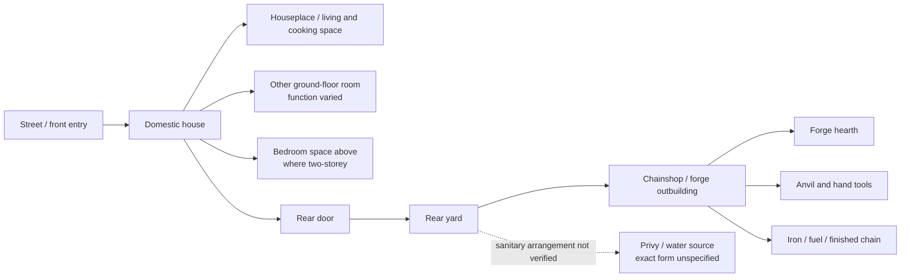
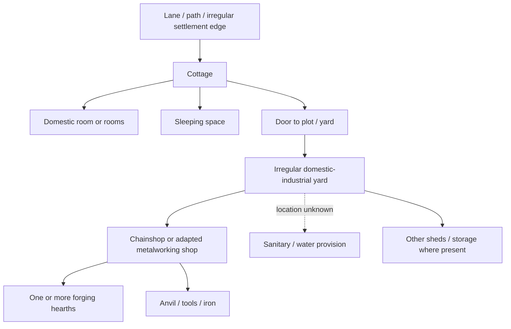
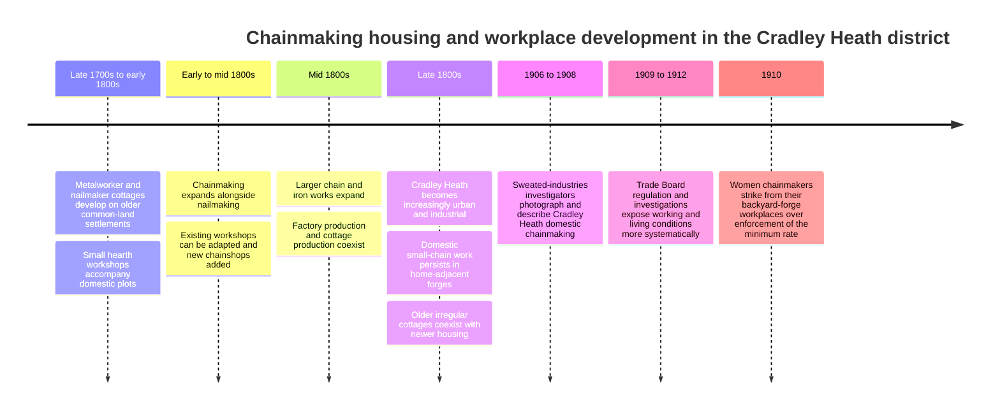

# Chainmakers’ Dwellings in Mushroom Green and Cradley Heath in the Late Nineteenth Century

iturn13image0

The photograph above, preserved by the University of Warwick Modern Records Centre, shows chainmakers’ workshops in Cradley Heath and was published in the *Daily News* handbook for its 1906 Sweated Industries Exhibition. Although a few years later than the requested late-Victorian period, it is one of the most valuable surviving visual records of the domestic-workshop environment that had developed during the nineteenth century: low workshops standing beside or behind dwellings rather than industrial hearths routinely occupying the principal living room. citeturn4view0turn13image0

## Executive summary

The most defensible reconstruction of a **late-nineteenth-century small-chainmaker’s home in the Cradley Heath district** is not simply “a cottage with a forge inside it.” It was more often a **domestic-production compound**: a modest dwelling, a yard or plot, and a small forge or “chainshop” in an attached, adjoining, or detached outbuilding. The University of Warwick’s Modern Records Centre, summarizing contemporary material in the Trades Union Congress archive, distinguishes the Black Country’s factory production of heavy and medium chain—predominantly male work—from small “hand-hammered” or “country-work” chain, much of it made by women and children in **small, cramped forges in outbuildings beside their homes**. citeturn4view0 Contemporary and near-contemporary descriptions of Cradley Heath in the anti-sweating literature of 1906–1912 therefore provide unusually strong evidence for a form of production that was already established before 1900. citeturn4view0turn7search36

**Mushroom Green needs to be distinguished from the more urbanized parts of Cradley Heath.** It originated as an irregular metalworking hamlet associated first with nailmaking and later increasingly with chainmaking. A published local-history synthesis, drawing on Dudley-area historical work including Ron Moss’s study of Mushroom Green, describes early cottages erected on or around former common land, with structures made variously from local brick, furnace slag, and—in the oldest phase—clay or “mud”; small workshops commonly accompanied the dwellings, and by the end of the nineteenth century chainshops were characteristic of the settlement. citeturn15search11 **[Unverified]** I have not been able to independently check those precise construction-material claims against Moss’s original 1977 text or an accessible Dudley archive building survey, so they should be treated as strong local-history evidence rather than as verified primary evidence.

For **Cradley Heath more generally**, the nineteenth century produced a mixture rather than a single house type. Older irregular cottages and encroachments survived alongside denser urban housing as the district industrialized. Cottage chainmakers could operate backyard shops, while men employed in larger chain works might occupy ordinary working-class houses without any domestic forge. The surviving evidence is therefore inconsistent with the idea that all chainmakers lived in detached cottages—or, conversely, that they predominantly occupied uniform rows of terraces. The late-century housing stock was heterogeneous. Warwick’s records establish the persistence of domestic outworking; later historical summaries of Cradley Heath likewise distinguish cottage outworking from factory chainmaking. citeturn4view0turn23search19

The **forge was normally functionally separate from the living accommodation** in the best-documented domestic chainmaking system. The evidence for separate backyard/outbuilding forges is considerably stronger than the evidence for chainmaking at a hearth situated openly inside the family houseplace. Warwick describes the work as occurring in outbuildings; Sandwell Council and the National Education Union, drawing on the history of the 1910 strike, similarly describe the women as working in “back yard forges.” citeturn4view0turn21search8turn22search35 There may have been exceptions, especially in very early or impoverished premises, but **I cannot verify a late-Victorian Mushroom Green or Cradley Heath example in which the normal domestic cooking/living room itself contained a working chain forge.**

This physical separation matters for reconstructing **cleanliness**. A chainshop would necessarily have accumulated fuel ash, soot, iron scale and fragments, and working clothing and bodies would carry forge dirt back toward the house. But it does **not** follow that the domestic rooms were uniformly filthy. Indeed, the spatial separation of hearth production into a yard workshop offered a practical boundary between industrial dirt and domestic space. **[Inference]** A plausible household would therefore show a sharp cleanliness gradient: extremely dirty forge floor and work surfaces; dirty yard and threshold; appreciably cleaner houseplace; carefully maintained bedding and “best” possessions where household resources permitted. The contemporary evidence supports the hot, cramped and industrially dirty nature of the workplace, but not the stereotype that chainmakers simply lived amid unchecked dirt. citeturn4view0turn7search36

Evidence for **water supply, privies and drains is notably weaker at individual-house level** than evidence for the workshops. The accessible Warwick catalogue identifies a 1912 internal Trade Board report specifically concerning working and living conditions in Cradley Heath, but the online catalogue does not expose enough of its text to justify inventing detailed claims about individual wells, pumps, water closets or earth closets. citeturn4view0 **I cannot verify this:** that a “typical” 1890s chainmaker’s house at Mushroom Green had a particular type of privy or a particular water source. Older irregular cottages probably differed substantially from newly built late-Victorian urban terraces, and national bylaw housing after the Public Health Act era increasingly incorporated regulated yards and sanitary provision, but applying that model to every Cradley Heath chainmaker would be unsafe. citeturn17search36

Likewise, exact **room dimensions** cannot responsibly be generalized. **Room dimensions: unspecified in the sources inspected.** There is no evidence here for a standardized chainmaker floor plan comparable to a model industrial housing estate. The safest plan is therefore schematic: one or two principal ground-floor domestic rooms, bedrooms above or in adjoining cottage space, a rear exit into a yard, and a separate chainshop beyond or beside it. That scheme is especially persuasive for late-century Cradley Heath domestic outworkers but should not be treated as a measured drawing of Mushroom Green. citeturn4view0turn13image0

Economically, the dwelling and workshop formed part of a **decentralized piecework system**. Low-paid domestic workers made small chain while merchants, middlemen or employers controlled access to work and markets; the extreme low wages documented in 1906–1910 were the culmination of the nineteenth-century sweating system rather than a sudden Edwardian invention. Warwick’s archive and Historic England both identify Cradley Heath chainmaking as a particularly severe example of home-based sweated labor. citeturn4view0turn7search36 The evidence inspected does **not** support describing chainmaker housing as predominantly employer-provided company housing. Domestic chainmaking instead depended upon workers having access to a house-and-workshop setting of their own household, whether rented or owned. Precise owner-occupier versus tenant percentages remain unspecified.

The strongest overall conclusion is therefore:

> **For a historically credible late-1890s Cradley Heath scene, picture a modest working-class house opening at the rear onto a small, intensely used yard and a low chainshop with one or more forge hearths—not a roaring industrial forge in the family kitchen. At Mushroom Green, make the plot more irregular, the buildings more vernacular and piecemeal, and the boundary between cottage, yard and workshop less geometrically urban.**

That model has **high confidence for the house–yard–forge relationship**, medium confidence for broad housing morphology, and low confidence for exact furniture, sanitary fittings, tenure proportions and dimensions.

## Evidence base and confidence

There is an important chronological problem in researching this subject. The best surviving and readily accessible documentary descriptions of the **domestic chainmaking workplace** cluster around the anti-sweating campaign of the first decade of the twentieth century, especially 1906–1912. The University of Warwick Modern Records Centre preserves or identifies the *Daily News* *Sweated Industries* handbook of 1906, Edward Cadbury and George Shann’s *Sweating* of 1908, Trade Board material after 1909, a 1912 internal investigation of Cradley Heath working and living conditions, contemporary newspaper coverage and photographs. citeturn4view0

That material cannot simply be relabeled “1890.” However, it documents a domestic production system that contemporary observers did not describe as newly created. Warwick explicitly places Cradley Heath’s emergence as a major chainmaking center in the **nineteenth century**, with smaller hand-hammered chain made in home-adjacent outbuildings, while later historical scholarship identifies domestic chainmaking as highly concentrated in and around Cradley Heath. citeturn4view0turn0search34 **[Inference]** Where an architectural arrangement appears in 1906 as an entrenched, numerous cottage industry and is independently described as nineteenth-century in origin, it is reasonable to use it as evidence for the late 1890s—but not necessarily for the 1830s or 1840s.

The evidential hierarchy used here is consequently:

| Evidence | What it can safely establish | Main limitation |
|---|---|---|
| Warwick Modern Records Centre/TUC archive catalogue and digitized material | Domestic outworking; separate small forges/outbuildings; division between heavy factory chain and smaller home chain; contemporary photographs; existence of 1906, 1908 and 1912 investigations | Most detailed material is 1906–1912 rather than 1880–1900. citeturn4view0 |
| 1906 photograph of Cradley Heath workshops | Actual scale and exterior character of domestic workshops; doors/openings; close relationship of workshop and domestic settlement | Photograph does not provide a measured plan, construction specification or household inventory. citeturn13image0turn4view0 |
| Historic England account of sweated industries | Broader context of homeworking, poverty and domestic/workplace overlap; backyard sheds in Cradley Heath | Primarily interprets the Edwardian anti-sweating campaign. citeturn7search36 |
| Sandwell Council / National Education Union | Corroboration of “back yard forges” and low-paid female chainmaking at the end of the domestic system | Centered on 1910. citeturn22search35turn21search8 |
| Black Country Living Museum | Material-culture comparator and major repository for Black Country buildings, workshops, photographs and objects; the museum contains reconstructed/rebuilt houses and industrial workshops and maintains a collection exceeding 80,000 objects/records | A museum reconstruction must not automatically be treated as evidence for a specific Mushroom Green household. citeturn10search39turn10search3 |
| Census returns | Names, occupations, family structure, household composition and birthplace; potentially useful for identifying chainmaking households | I did not obtain enough address-level Mushroom Green/Cradley Heath enumerator sheets in this research pass to calculate occupancy or tenure rates. The National Archives confirms the nature of the surviving census schedules. citeturn12search1 |
| Mushroom Green local-history synthesis | Settlement origin, vernacular material traditions, association of cottages with nail/chain shops | Secondary/tertiary; several details require checking against Ron Moss and Dudley archives before treating them as primary evidence. citeturn15search11 |
| Sheila Blackburn’s scholarly work on Black Country chainmakers and anti-sweating | Academic context for the localized domestic chain trade and the later reform campaign | The accessible search record did not expose the full article text for detailed architectural extraction. citeturn0search34 |

This evidential distinction is particularly important for **furnishings and sanitation**. It would be easy to populate a cottage with generic “Victorian” furniture or assign it the familiar outside privy and communal pump. Such details may be historically plausible, but unless tied to a Cradley Heath inventory, photograph, valuation, probate document or sanitary inspection, they remain reconstruction rather than evidence.

Black Country Living Museum is especially valuable for future object-level work because its remit includes reconstructed houses, shops and industrial workshops and a substantial collection of historical objects and photographs. citeturn10search3turn10search39 Its Locksmith’s House material is also a useful **regional comparator** for a Black Country household in which domestic life and small-scale metal manufacture were closely connected, although locksmithing in Willenhall should not be silently substituted for chainmaking in Cradley Heath. citeturn10search31

## Settlement form, house types, and construction materials

The defining feature of Mushroom Green was **irregularity**. Unlike a purpose-built factory village laid out by a single owner, it developed incrementally from a metalworking hamlet. Local historical accounts trace it back to nailmaking settlement on or around former common land associated with Pensnett Chase; small industrial buildings accompanied many dwellings, and chainmaking increasingly displaced or supplemented nailmaking during the nineteenth century. citeturn15search11

**[Unverified]** The local history account reports three especially important vernacular construction traditions at Mushroom Green: early clay or “mud” structures, buildings incorporating local blast-furnace slag, sometimes later rendered, and cottages built in local brick. citeturn15search11 These are credible in the geological and industrial context of the Black Country, but **I cannot verify from an accessible late-nineteenth-century building schedule what proportion of Mushroom Green houses in, say, 1881 or 1891 belonged to each construction type.**

Nor should “cottage” automatically be translated as “detached.” A cottage settlement growing piecemeal around common-land encroachments could contain freestanding, paired, clustered and joined structures. **[Inference]** Mushroom Green in the 1890s is better imagined as a collection of irregular cottages and small groups of buildings on plots of differing shape and orientation than as either a suburb of standardized detached houses or a continuous grid of terrace streets. The settlement history and the survival of workshops beside houses support that interpretation. citeturn15search11

Cradley Heath as a whole underwent a different scale of nineteenth-century growth. The district changed from comparatively open heath with encroachment cottages to an industrial settlement strongly associated with nailmaking, chainmaking and larger ironworks. Historical summaries record cottages being erected on the heath and describe the subsequent coexistence of cottage chainmaking with factory production. citeturn23search19turn4view0

By the late nineteenth century, therefore, at least three relevant residential forms should be distinguished.

| Dwelling/workplace type | Likely location and occupants | Form | Forge relationship | Evidence/confidence |
|---|---|---|---|---|
| **Older irregular metalworker’s cottage** | Particularly appropriate to Mushroom Green and older peripheral settlements | Small cottage, freestanding, paired or irregularly joined; plot not necessarily aligned to a formal street | Small shop beside or behind cottage; workshop could have evolved from an earlier nailshop | **Medium-high** for cottage + workshop pattern; **lower** for precise form. citeturn15search11turn4view0 |
| **Late-century urban working-class terrace** | More urbanized Cradley Heath | Brick row house, usually narrow plot with rear yard | Domestic chainworker could have rear-yard forge/shop; factory worker might have no home workshop | **[Inference] Medium.** Cottage outworking is securely documented; the exact percentage living in standardized terraces is not. National late-Victorian bylaw development makes this form plausible, but no local housing census was obtained. citeturn4view0turn17search36 |
| **House plus substantial shared/family chainshop** | Established chainmaking households | Dwelling with larger workshop accommodating more than one hearth/worker | Workshop closely adjacent but industrially distinct | **High** for existence of multiworker backyard shops by 1906; continuity into late 1890s is an inference. citeturn4view0turn13image0 |
| **Ordinary house occupied by factory chainmaker** | Men making heavier/medium chain in works | Housing need not contain industrial workspace | Forge entirely at employer’s works | **High** conceptually because contemporary sources explicitly distinguish factory heavy/medium chain from domestic small chain. citeturn4view0 |

This distinction also resolves an apparent contradiction in descriptions of chainmakers. A male heavy-chain smith at a substantial works and a woman making light agricultural chain at home might both appear in census or directory material under a chainmaking occupation, yet their houses could differ fundamentally. The man’s dwelling might be purely domestic; the woman’s property was simultaneously a household and a decentralized industrial workplace. Warwick explicitly distinguishes these sectors. citeturn4view0

The **chainshop itself** should generally be visualized as a low, utilitarian structure rather than a miniature house. The 1906 Warwick image records low workshop buildings with large door openings and workers immediately at the threshold, consistent with a workspace needing easy passage, daylight and air around hot hearths. citeturn13image0turn4view0 The photograph is more useful for scale and relationship than for material identification: **wall and roof construction cannot safely be standardized from this image alone.**

At Mushroom Green the workshop tradition appears to have evolved from nailshops. **[Unverified]** Local history reports that a chain workshop was recorded there by the early nineteenth century and that nailmaking hearths could be adapted to chain work, while purpose-built chainshops tended to become larger or more communal; by the later nineteenth century workshops were a prominent element of the hamlet. citeturn15search11 That evolutionary history is important: the settlement probably accumulated buildings through adaptation rather than periodic wholesale redevelopment.

The material evidence therefore points toward **architectural accretion**. An older cottage could precede its chainshop, a nailshop might be converted, another hearth could be added, or a later brick workshop might sit beside an earlier house. A writer or visual reconstruction should resist making every wall, roofline and window match.

## Room use, forge arrangement, light, heating, cooking, and furnishings

For domestic chainmakers, the most significant architectural boundary was between the **domestic hearth** and the **industrial hearth**.

Warwick’s archival summary is unusually clear: smaller hand-hammered chain was often produced by women and children “in small, cramped forges in outbuildings next to their homes.” citeturn4view0 National Education Union and Sandwell accounts of the same surviving tradition refer specifically to the women’s “back yard forges.” citeturn21search8turn22search35 Thus, for the mature late-nineteenth-century cottage industry, a rear or side chainshop is better evidenced than a forge sharing the principal living room.

That does **not** mean the workshop and house were psychologically or economically separate. A worker could step from house to yard to forge in seconds; children and family members could circulate between them; fuel, iron and finished chain had to pass through the domestic plot. Work was therefore “homeworking” even when the fire itself was outside the dwelling envelope. Historic England emphasizes how domestic sweated labor erased much of the normal separation between family life and production. citeturn7search36

A defensible **typical ground-floor functional sequence** is:

**street/entry → domestic room or houseplace → rear access → yard → chainshop**

Bedrooms occupied an upper floor where the house had two stories. A second ground-floor room might function as kitchen, scullery, parlor or multipurpose room depending upon house type and prosperity. **I cannot verify a universal Cradley Heath chainmaker arrangement of “front parlor + rear kitchen,” nor can I verify a standard two-up/two-down plan for Mushroom Green.**

Cooking and ordinary household heating belonged to the domestic hearth/range, not the chain forge. A black-leaded iron kitchen range was a central technology of Victorian working-class domestic life because one installation could provide fire, cooking and hot water; surviving-house interpretation at Victorian museums documents this combination. citeturn24search24 **[Inference]** It is highly plausible that better-established late-century Black Country chainmaking homes used a coal-fired range or grate of this kind, but the source inspected is a national Victorian-house comparator rather than an inventory of a specific Cradley Heath property.

The industrial fire was qualitatively different. It needed to bring wrought iron to forging temperature and therefore demanded a concentrated hearth, air blast/bellows, fuel supply, anvil and hand tools. The contemporary photographs and accounts identify the chainshop as the dedicated location for that activity. citeturn4view0turn13image0

### Light and ventilation in practice

The 1906 workshop photograph is valuable precisely because the shops do not resemble sealed rooms: work takes place close to generous door openings, while the hot-forge descriptions emphasize the severe thermal environment. citeturn13image0turn4view0

**[Inference]** Daylight would have been most useful around the doorway and any windows; deep portions of a small workshop could remain dim, especially in winter. Forge light itself would illuminate heated metal dramatically without providing uniform working illumination.

**[Inference]** Ventilation was probably primarily passive—doors, windows/openings and the natural draught associated with the hearth/flue—rather than a mechanical extraction system. Nothing in the evidence inspected suggests sophisticated powered ventilation in backyard chainshops. The fact that contemporary observers characterized the work as hot and cramped is consistent with limited environmental control. citeturn4view0

The distinction between **“ventilated at all” and “well ventilated”** is crucial. A permanently open workshop door provides substantial airflow while simultaneously indicating that the building lacks engineered temperature control. A chainshop could be draughty in winter yet oppressively hot immediately around a forge.

### Furnishings and equipment

There is no surviving room-by-room inventory in the material I could verify for a representative Mushroom Green chainmaker in the 1890s. The following table therefore separates secure workshop equipment from reconstruction-grade domestic furnishing.

| Space | Contents that can responsibly be reconstructed | Status |
|---|---|---|
| **Chainshop/workshop** | Forge/hearth; anvil or chainmaker’s stake/anvil; hammers; tongs; iron bar/rod or partly formed links; finished chain; fuel; working surfaces/storage | Core equipment is **high confidence**, being intrinsic to hand-forged chainmaking and consistent with contemporary workshop evidence. citeturn4view0turn13image0 |
| **Houseplace / living-kitchen** | `[Inference]` Cooking range or grate; working/dining table; chairs or stools; crockery and basic storage; kettle and cooking utensils | Range is strongly plausible from Victorian working-class material culture, but there is **no chainmaker-specific inventory in the inspected sources**. citeturn24search24 |
| **Separate kitchen/scullery, where present** | `[Inference]` Sink or wash vessel, buckets, pans, food storage, laundry equipment; possibly the principal range if house had a distinct front living room | **Low-to-medium confidence.** Presence of such a room varies by house type. |
| **Parlor/front room, where present** | `[Inference]` Better chairs, small table, ornaments, family photographs/religious or decorative objects, perhaps a clock | **Low confidence** for chainmakers specifically; should not be assumed in the poorest or smallest cottages. |
| **Bedroom(s)** | `[Inference]` Bedstead, mattress/bedding, chest or drawers/pegs, wash bowl/jug; chamber vessel where sanitation was outside | **Low-to-medium comparative confidence; chainmaker-specific inventory unavailable.** |
| **Yard** | Fuel, iron awaiting work or collection, workshop access; `[Inference]` ash/industrial waste area and domestic washing/drying activity | Mixed industrial/domestic use is **highly plausible** from the house–yard–shop arrangement, but exact organization is unspecified. citeturn4view0turn13image0 |

The absence of a sofa, carpet or elaborate furniture from this table should not be read as evidence that chainmakers lacked them. Household possessions varied with age, earnings, inheritance and tenure. Equally, applying a prosperous middle-class Victorian parlor to a severely underpaid female outworker would be misleading. The early-twentieth-century anti-sweating sources document extremely low earnings among the poorest chainmakers, making sparse furnishing plausible for those households. citeturn4view0turn7search36

Black Country Living Museum’s reconstructed buildings and object collection offer the strongest modern repository for refining this room-content reconstruction; the museum explicitly interprets Black Country houses, shops and workshops and maintains a collection of more than 80,000 items. citeturn10search39turn10search3 But a museum room setting should always be checked against its stated date and provenance before being used as an exact Mushroom Green interior.

## Water, sanitation, cleanliness, and crowding

This is the area where the surviving web-accessible evidence most strongly demands restraint.

The existence of poor working conditions is exceptionally well established. Warwick characterizes domestic chainmaking forges as small, cramped and hot, while the anti-sweating investigations were concerned precisely with the relationship between low wages, home industry and living conditions. citeturn4view0 Historic England similarly identifies homeworking as the worst-paid and often most oppressive part of the sweated system. citeturn7search36

But “poor working conditions” cannot automatically be converted into a specific plumbing layout.

### Water and sanitation

For a particular late-1890s Mushroom Green cottage, the following remain **unspecified** in the evidence inspected:

| Question | Finding |
|---|---|
| Piped water inside dwelling? | **Unspecified.** |
| Individual outside tap? | **Unspecified.** |
| Shared standpipe/pump? | **Unspecified.** |
| Private well? | **Unspecified.** |
| Water closet? | **Unspecified.** |
| Midden/privy/pail closet? | **Unspecified at property level.** |
| Connection to public sewer? | **Unspecified.** |
| Dedicated bathroom? | **No evidence found; should not be assumed.** |
| Sink/scullery drainage? | **Unspecified.** |

This is not because the questions are unanswerable in principle. Local authority sanitary committee minutes, Medical Officer of Health reports, drainage plans, rating records and the 1912 Trade Board investigation are likely places to resolve them. Warwick specifically catalogs a 1912 internal report about working and living conditions in Cradley Heath. citeturn4view0 What would be methodologically wrong is to fill those gaps with a generalized “Victorian slum” template.

Later nineteenth-century urban building regulation nationally increasingly required more formal sanitary arrangements in newly built working-class terraces; the “bylaw terrace” is specifically associated with the post-1875 regulatory environment and rear-yard sanitary provision. citeturn17search36 **[Inference]** Consequently, a newly erected 1890s Cradley Heath terrace could plausibly have had more systematic yard drainage and privy provision than an older irregular Mushroom Green encroachment cottage. That is a useful distinction for reconstruction, not evidence that every late-century terrace had a flush WC.

### How dirty was a chainmaker’s home?

The forge itself was inherently dirty. Hot forging using solid fuel creates ash, soot and scale; hammering hot iron sheds oxide scale and small metallic debris. Workers also handled iron and fuel continuously. The contemporary record independently establishes the hot, physically punishing character of the work and locates it in cramped domestic workshops. citeturn4view0

The key analytical point, however, is to distinguish **industrial dirt** from **domestic housekeeping**.

| Indicator | Likely condition | Evidential status |
|---|---|---|
| Forge floor around hearth/anvil | Heavy ash, scale, fuel dust and metal debris | `[Inference]` **Very high probability** from the industrial process; exact photographs are not detailed enough to quantify. citeturn13image0turn4view0 |
| Forge walls/rafters | Soot-darkening probable, especially around fire/flue | `[Inference]` High probability. |
| Work clothes/hands | Regular contact with soot, oxide and hot iron; garments likely heavily marked in work | `[Inference]` High probability; no 1890s laundry inventory found. |
| Yard between workshop and house | Dirt transfer, ash/fuel movement and iron traffic | `[Inference]` High probability given the physical layout. |
| Rear threshold/entrance | Likely principal contamination point entering house | `[Inference]` Medium-high probability. |
| Houseplace floor | Some transferred industrial dirt, but capable of routine sweeping/scrubbing | `[Inference]` Medium probability. |
| Furniture, crockery and bedding | **No evidence that these were habitually forge-filthy.** Spatially separated shop makes a cleaner domestic zone plausible | `[Inference]` Medium confidence in relative separation; exact cleanliness unknown. |
| Privy/drain sanitation | Cannot infer from forge dirt | **Unknown.** |
| Damp/mold | No representative property data located | **Unknown.** |

It would therefore be inaccurate to write that “everything in a chainmaker’s cottage was black with soot.” The evidence supports an intensely dirty **workshop**, not universal domestic squalor.

**[Inference]** For fiction or visual reconstruction, one of the most realistic details would be the contrast: blackened tools, floor scale and fuel dust in the chainshop; a dirty path or rear threshold; then deliberately maintained domestic surfaces, crockery, bedding and “best” possessions. Poverty increases the difficulty of cleanliness but does not erase the cultural value placed on it.

### Crowding and sleeping arrangements

The census is theoretically the best source for this question. Nineteenth-century enumerator schedules preserve household composition and occupations, allowing chainmaking families to be identified and compared. The National Archives confirms the surviving household-level nature of the census returns. citeturn12search1

However, **I did not recover a sufficiently large sample of identifiable Mushroom Green or chainmaking addresses to calculate people-per-room statistics.** Claims such as “six people typically slept in two bedrooms” would therefore be fabricated.

Overcrowding nevertheless remains plausible in the poorest households because contemporary anti-sweating sources document extraordinarily low earnings and family-based domestic production. citeturn4view0turn7search36 **[Inference]** Where a cottage offered only one or two sleeping rooms, a household with several children or lodgers would necessarily share bedrooms and often beds. But frequency and severity must be established address by address.

### “Squatting” requires chronological care

Mushroom Green’s history contains a genuine **squatter/encroachment origin story**, but it is hazardous to describe its 1890s residents indiscriminately as squatters. Local historical accounts associate the early hamlet with metalworkers building on former common land and describe subsequent regularization of landholding/rents after enclosure. citeturn15search11

Thus:

**Earlier eighteenth-/early-nineteenth-century encroachment** → meaningful use of “squatter.”

**Late-nineteenth-century descendant occupying an established cottage** → not necessarily a squatter at all.

**[Inference]** By the 1880s–1890s, “squatter settlement in origin” is a safer phrase than “a settlement of squatters.”

## Tenure, household economy, and social variation

There was no single “chainmaker class” occupying a single house type.

The trade ranged from male workers making heavy and medium chain in factories to home-based workers—disproportionately women in the small-chain sector—working in backyard forges. Warwick makes this occupational distinction explicit. citeturn4view0 This alone implies meaningful variation in income, workplace investment, dwelling type and household organization.

The **poorest home chainmakers** became emblematic of the sweated trades. Contemporary reform material described exceptionally low earnings, long hours and physical labor; by 1910 the minimum-rate controversy brought hundreds of Cradley Heath women out of their backyard forges. citeturn4view0turn21search8turn22search35 Those conditions strongly suggest households with little disposable income for improvements or elaborate furnishings.

At the opposite end of the small-scale sector could be households with a more substantial workshop, multiple hearths or several family members engaged in production. **[Inference]** Such a household might possess more capital without ceasing to be a cottage-industry household: the shop itself—forge hearths, anvils, tools, fuel storage—represented productive capital attached to domestic property.

The system’s economic geography also mattered. Domestic chainmaking allowed paid work to be fitted around the household and kept production physically close to children and domestic responsibilities; the same structure shifted much of the burden of workspace, fuel handling and household disruption onto the worker. Historic England emphasizes the broader anti-sweating concern with exactly this overlap between production and domestic life. citeturn7search36

### Owner-occupiers versus tenants

Precise proportions are **not established** by the evidence inspected.

**[Unverified]** Mushroom Green’s local history suggests that early informal occupation of common land evolved into more formal rent/tenure relationships after enclosure. citeturn15search11 It would therefore be unsafe to assume either universal ownership or universal tenancy by the end of the nineteenth century.

A chainshop does not prove owner-occupation. A landlord could rent a cottage with an existing workshop; a tenant family might adapt an outbuilding; a property-owning chainmaker might have constructed or inherited both house and shop.

**I cannot verify this:** a statistically typical late-1890s owner-occupancy rate among chainmakers at Mushroom Green or Cradley Heath.

### Employer-provided housing

No evidence located in the inspected material establishes a significant **company-housing regime** for Cradley Heath’s domestic chainmakers comparable to a model village or tied colliery settlement.

**[Inference]** The structure described in contemporary sources points in the opposite direction: small-chain production was dispersed through private domestic premises and backyard shops, while larger production occurred in works. citeturn4view0 That does not prove that no employer ever owned or rented a worker a house, only that **employer-provided housing should not be treated as the normal architectural model** without case-specific evidence.

### Middlemen, independence and the deceptive appearance of the “home workshop”

Working at home did not necessarily mean economic independence. The anti-sweating literature treated domestic chainmaking as a form of dependent piecework rather than prosperous artisanal self-employment. citeturn4view0turn7search36 A family might possess the forge and tools yet remain highly dependent on those controlling orders, iron supply and prices.

That distinction is useful when interpreting the architecture. A private chainshop in the backyard could make the household look like a tiny autonomous business, while the economic reality could be one of severe bargaining weakness.

The social variation can be summarized as follows:

| Household position | Likely dwelling/workshop relationship | Economic implication |
|---|---|---|
| Poor female/light-chain outworker | Modest house + small cramped rear forge | Strongest association with sweating and very low piecework earnings. citeturn4view0turn7search36 |
| Multiworker chainmaking family | House + somewhat larger shop, possibly multiple work stations | `[Inference]` More productive capacity but not necessarily higher living standards per person. |
| Skilled male factory chainmaker | Ordinary working-class house, forge at works | Domestic rooms substantially less exposed to direct production dirt. citeturn4view0 |
| Small master/intermediary | Potentially better house/workshop and more capital | **Not quantified in sources inspected.** |
| Tenant chainmaker | Rented dwelling/workshop possible | Frequency **unspecified**. |
| Owner-occupier | Property and workshop could represent household capital | Frequency **unspecified**. |
| Employer-tied tenant | Possible in isolated cases | **No evidence found that this was the normal Cradley Heath system.** |

## Change across the nineteenth century, reconstructed plans, and primary sources

The nineteenth century did not simply replace cottages with factories. In Cradley Heath, **factory production and domestic forging developed alongside each other**, differentiated partly by chain size and workforce. Warwick’s overview identifies men making heavy and medium chain in works while smaller hand-hammered chain remained a cottage/outwork trade associated strongly with women and children. citeturn4view0

Mushroom Green illustrates the long continuity particularly clearly. **[Unverified]** Local historical reconstruction describes an older nailmaking landscape in which cottages and hearth workshops already stood together; chainmaking then occupied and expanded that inherited physical infrastructure. citeturn15search11 The later chainshop was therefore not simply an industrial building planted behind a suburban house. In older settlements the house-and-workshop complex itself was the product of generations of domestic metalworking.

At the same time, Cradley Heath grew into a substantially more urban industrial center during the nineteenth century. Historical accounts associate the district’s growth with nailmaking, chainmaking and major ironworks and record continuing cottage outwork alongside factory manufacture. citeturn23search19turn4view0 **[Inference]** By the 1880s and 1890s, the characteristic older cottage-and-shop landscape was consequently intermingled with newer brick urban housing rather than having disappeared.

The Edwardian anti-sweating investigations represent not the beginning but the point when this mature nineteenth-century system became nationally visible. The *Daily News* exhibition documented it photographically in 1906; Cadbury and Shann treated Cradley Heath in their 1908 analysis of sweating; the Trade Boards Act era led to direct regulation and investigation; Warwick holds an internal 1912 report on local working and living conditions. citeturn4view0 The 1910 strike then provides particularly strong corroboration that the female workers’ normal workplaces were backyard forges. citeturn21search8turn22search35

**Interpretive floor plan: domestic chainmaker in the more urbanized Cradley Heath district, c. 1880s–1900.** This is deliberately **not to scale**. No standard room dimensions were established. Solid links represent well-supported functional relationships; uncertain sanitary provision is shown separately.

The crucial evidence behind this reconstruction is **not** the internal subdivision of the house, which remains variable, but the rear-yard relationship to a dedicated chainshop established by contemporary archival descriptions and photographs. citeturn4view0turn13image0turn21search8

**Interpretive plan: Mushroom Green.** The key difference is less formal plot geometry.

**[Inference]** This diagram is intended to convey settlement morphology, not to reproduce any one surviving house. Its irregularity reflects Mushroom Green’s incremental metalworking-settlement history; exact room arrangement, privy position and dimensions remain unverified. citeturn15search11

The broad evolution can be represented as:

The first two Mushroom Green stages depend partly on local-history reconstruction and therefore have lower evidential confidence than the 1906–1912 stages. citeturn15search11turn4view0 The factory/domestic split and nineteenth-century concentration of chainmaking around Cradley Heath are independently supported by Warwick’s archival overview. citeturn4view0

**Primary and near-primary sources used or identified**

| Source | Date | Relevance |
|---|---:|---|
| *Sweated Industries: Being a Handbook of the Daily News Exhibition* | 1906 | Contemporary anti-sweating handbook containing George Shann’s material and photographs, including the key photograph of Cradley Heath chainmaking workshops. Preserved/digitized through Warwick MRC. citeturn4view0turn13image0 |
| Cradley Heath chainmakers’ workshop photograph reproduced in the *Daily News* exhibition handbook | 1906 | Direct visual evidence for low domestic workshops, openings and relationship of workers to the shop. citeturn13image0turn4view0 |
| Edward Cadbury and George Shann, *Social Service Handbooks No. 5: Sweating* | 1908 | Contemporary social investigation including Cradley Heath chainmaking; cataloged and digitized through Warwick MRC. citeturn4view0 |
| Trade Board / TUC archival papers on the chain trade | c. 1909 onward | Administrative documentation produced as wage regulation was introduced; important for employment structure and conditions. citeturn4view0 |
| Internal report on working and living conditions in Cradley Heath | 1912 | Particularly promising official/administrative source for household and workplace conditions; cataloged by Warwick. The full detailed sanitary data could not be extracted in this research pass. citeturn4view0 |
| *Daily Express* report concerning Patience Round, veteran woman chainmaker | 1910 | Contemporary personal evidence relating to a woman whose chainmaking career extended deep into the nineteenth century; Warwick identifies the item in its digital collection. citeturn4view0 |
| England and Wales census enumerator schedules | especially 1881 onward | Primary source for identifying chainmaker households, occupations and co-residents. The National Archives describes the surviving returns; no statistically adequate Mushroom Green sample was extracted here. citeturn12search1 |
| Black Country Living Museum historic buildings/objects/photographic collections | nineteenth–twentieth-century material | Material-culture and comparative architectural evidence. Museum holdings include houses, shops, industrial workshops and a collection exceeding 80,000 items. citeturn10search39turn10search3 |

Several further sources are important **secondary or interpretive controls rather than primary evidence**. Historic England’s treatment of Mary Macarthur and sweated industries contextualizes homeworking and backyard chainshops. citeturn7search36 Sheila Blackburn’s scholarly work on Black Country chainmakers provides an academic framework for the anti-sweating history and the geographical concentration of domestic chainmaking around Cradley Heath. citeturn0search34 Ron Moss’s work on Mushroom Green and Black Country chainmaking is repeatedly cited in local historical treatments, but **I cannot verify the original 1977 Mushroom Green text directly from the accessible material**, so the specific vernacular-building details drawn through later summaries have been labeled accordingly. citeturn15search11

The most useful photographic/visual starting points are the **Warwick MRC 1906 Cradley Heath workshop image** above, which is a contemporary source, and the **Black Country Living Museum collections database**, which provides access to a much broader body of Black Country buildings, photographs and objects. citeturn13image0turn10search3 The museum’s reconstructed buildings are particularly valuable for scale, surface treatment and domestic material culture, but should be used as analogues unless their provenance specifically identifies Cradley Heath or Mushroom Green. citeturn10search39

The largest remaining evidential gaps are **household-level water and privy arrangements; exact room dimensions; quantified owner-occupation versus tenancy; landlord identities; room-by-room furnishings; and statistical overcrowding**. None can responsibly be supplied as a single “typical” figure from the sources inspected. Address-level linkage of the 1881/1891/1901 census to rate books, Ordnance Survey plans, sanitary committee records, trade directories and the 1912 Trade Board investigation would be required to resolve them. citeturn12search1turn4view0

The resulting historical picture is nevertheless reasonably firm where it matters most architecturally: **Mushroom Green retained the character of an older, irregular cottage metalworking settlement; greater Cradley Heath contained a wider mixture of old cottages and later urban housing; small-chain domestic production took place characteristically in low backyard or home-adjacent forges; and the house, yard and forge together—not the cottage interior alone—formed the fundamental unit of chainmaking life.** citeturn4view0turn13image0turn15search11